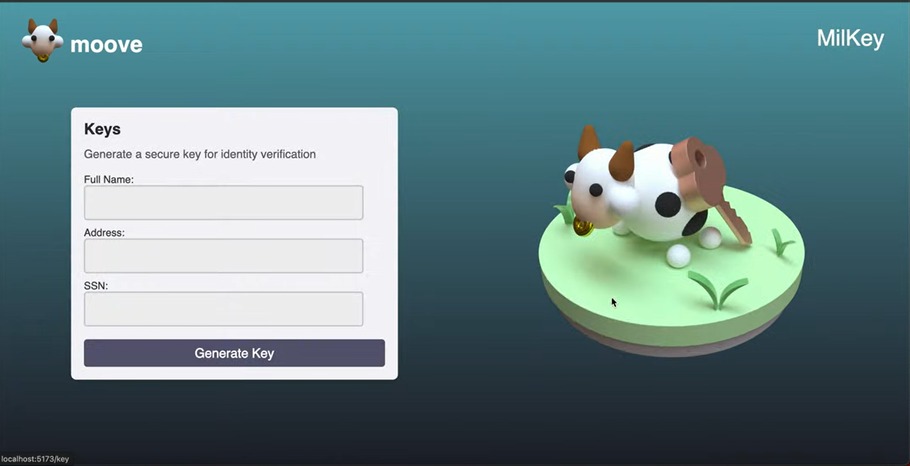
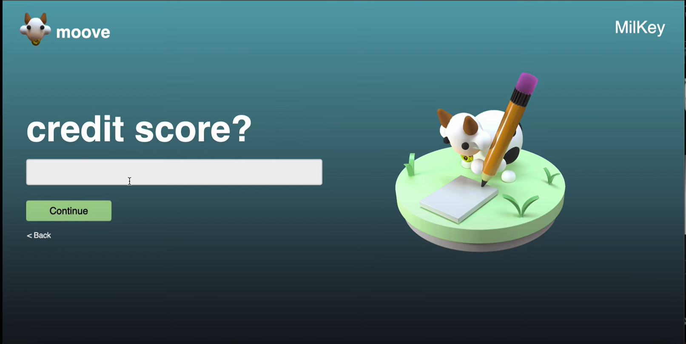
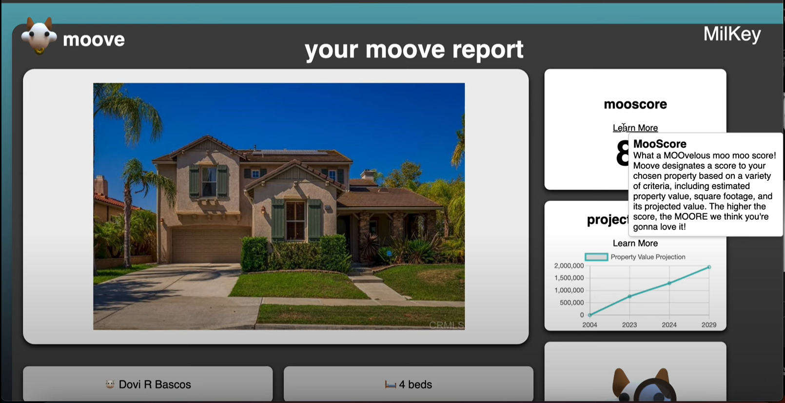

# Moove: It's The Moove

## Introduction
Moove is a comprehensive app designed to streamline the moving-out process for college students. It offers two primary functionalities: ownership authentication and property rundown. By utilizing modern web technologies and powerful APIs, Moove aims to provide accurate and efficient assistance to users.

## Features

### Ownership Authentication
Moove ensures the authenticity of ownership for properties through a robust verification process. This feature relies on Firebase for storing ownership keys securely in the cloud. Users can authenticate their ownership status, which is crucial for accessing certain functionalities within the app.
## 📸 Screenshots

-  Landing Page
  
- Identification Key
  
-  Fill info
  
-  Moove report(dashboard)
  
-  Mortgage Calculator(dashboard)
  
### Property Rundown
One of the core features of Moove is its ability to provide a detailed rundown of inputted properties. Through integration with the Melissa Data API, Moove retrieves accurate data regarding houses and their ownership status. This information is presented to users in an organized manner, facilitating informed decision-making during the moving-out process.

## Technologies Used

### Frontend
- React: Moove's frontend is built using React, offering a dynamic and responsive user interface.
- Womp: Womp is utilized for enhancing the frontend experience with interactive elements and smooth transitions.

### Backend
- Node.js: Moove's backend is powered by Node.js, providing a scalable and efficient runtime environment.
- Express.js: Express.js is used for building robust and flexible APIs to handle various backend functionalities.

### APIs
- Melissa Data API: Moove leverages the Melissa Data API for accurate retrieval of house data and ownership verification.
- Google Street View API: We used it to get images of the houses but we stopped because it was charging us :(

### Database
- Firebase: Firebase is utilized for storing ownership keys securely in the cloud, ensuring seamless access across different projects.

## Getting Started
To get started with Moove, follow these steps:
1. Clone the Moove repository from GitHub.
2. Install the necessary dependencies using npm or yarn.
3. Set up Firebase authentication for ownership verification.
4. Configure the Melissa Data API in a .env file for accessing property data.
5. Run the application locally using `npm run dev`.

## License
Moove is licensed under the MIT License. We also used the Melissa API. See the LICENSE file for more details.

## Contact
If you have any questions or suggestions regarding Moove, feel free to reach out to us at [aliyarahmani786@gmail.com](mailto:aliyarahmani786@gmail.com).
